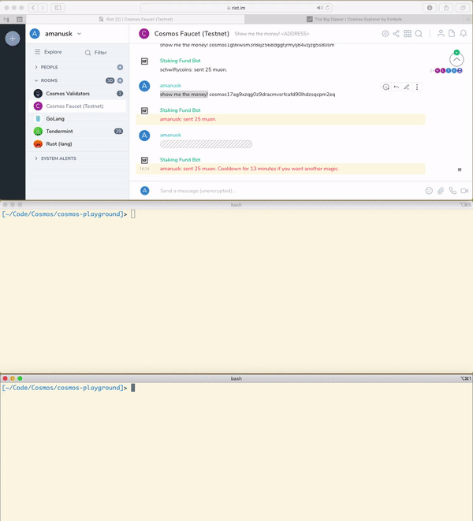

# Cosmos Threshold Wallet

Cosmos wallet powered by two-party ECDSA.

__WIP!! Use at your own risk__

## Installation
1. Install [Node.js](https://nodejs.org/en/download/)<br>
(tested on Node 10)
2. Install [nightly Rust](https://github.com/rust-lang/rustup.rs#installation)<br>
(tested on rustc 1.38.0-nightly (0b680cfce 2019-07-09))
3. Install the package:
```sh
git clone https://github.com/KZen-networks/cosmos-thresh-wallet.git
cd cosmos-playground
yarn install
yarn build
```
Built files will be located in the `dist` folder.


## Running the Code
You can run a demo using the command line.  
Server:
```sh
$ demo/server
```
Client:
```sh
Usage: client [options] [command]

Options:
  -h, --help                                                                 output usage information

Commands:
  address [options]
  balance [options] <address>
  delegations [options] <address>
  rewards [options] <address>
  unbonding [options] <address>
  redelegations [options]
  apr [options]
  commission [options] <validator>
  validator_apr [options] <validator>
  tx [options] <txhash>
  transactions [options]
  transfer [options] <from> <to> <amount>
  delegate [options] <from> <to> <amount>
  undelegate [options] <delegator> <validator> <amount>
  redelegate [options] <delegator> <validator_src> <validator_dst> <amount>
  collect [options] <delegator>
```

* Start by generating a new address.
* Populate the address with coins from testnet [faucet](https://riot.im/app/#/room/#cosmos-faucet:matrix.org)  


## Testing
Replace addresses with in test file with addresses generate with
`./demo/client address` and populated with testnet coins
You can generate a new address using the same share, but specifying the index  

Exmpale: 
```sh
./demo/client address --index 1
```

## Demo


## License
GPL-3.0
